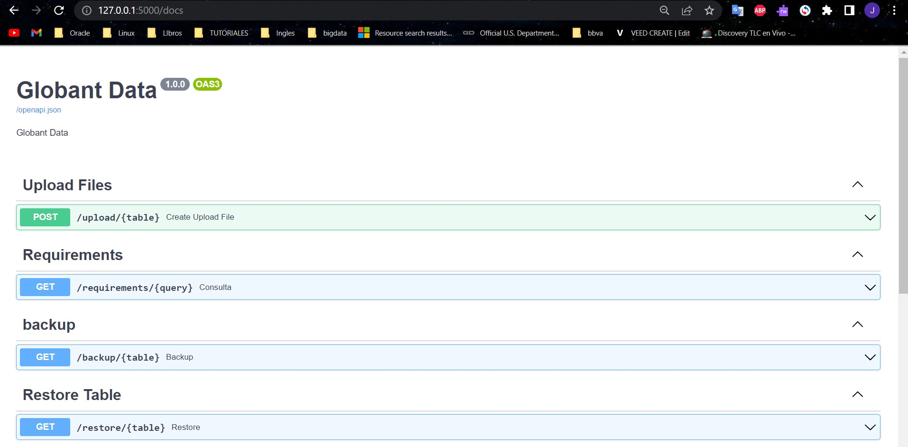
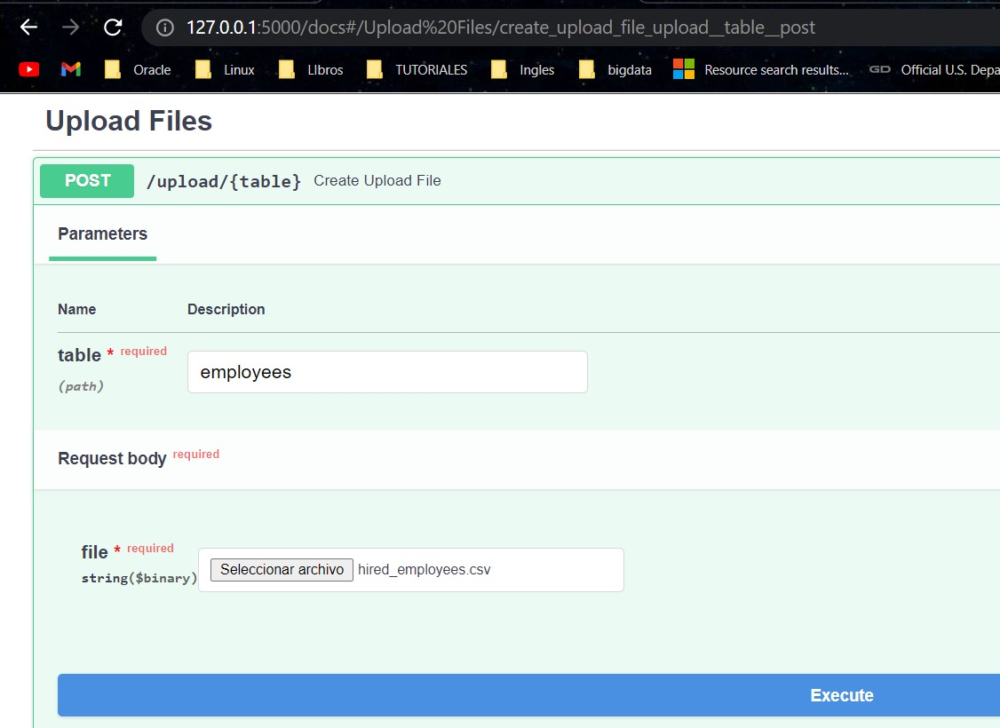
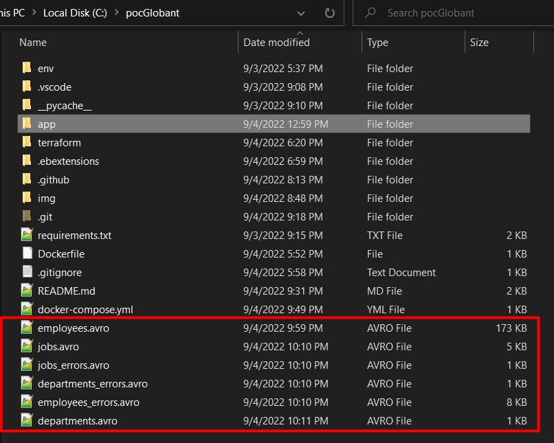

# Welcome to pocPython
The following repository aims to build a python api using fastapi and sqlalchemy, which connects to a postgres database apovisioned in terraform

1. Move historic data from files in CSV format to the new database.
2. Create a Rest API service to receive new data. This service must have:
2.1. Each new transaction must fit the data dictionary rules.
2.2. Be able to insert batch transactions (1 up to 1000 rows) with one request.
2.3. Receive the data for each table in the same service.
2.4. Keep in mind the data rules for each table.
3. Create a feature to backup for each table and save it in the file system in AVRO format.
4. Create a feature to restore a certain table with its backup.

## Data Rules
- Transactions that don't accomplish the rules must not be inserted but they must be
logged.
- All the fields are required.


To run the project go to the poc_python folder and execute:

```
docker-compose up -d
```
and access your browser http://127.0.0.1:5000

### Interactive API documentation



## 1. Upload files to the database

Parameters
- Table: table name accepted (employees, jobs, departments)
note: Different names are not accepted due to the data validation process.
- File to load *.csv



## 2. Requirements generation

Click on the following links and you will automatically download the report in csv format.

- http://127.0.0.1:5000/requirements/quarter

- http://127.0.0.1:5000/requirements/media

## 3. Backup table

http://127.0.0.1:8000/backup/'name_table'

name of accepted tables
- employees
- jobs
- departments

Error table:
- employees_errors
- jobs_erros
- departments_erros

Example:

http://127.0.0.1:8000/backup/jobs



In the root of the project you will see reflected the creation of the backups in .avro format.

### Folder structure
```
app
    ├───config
    │   └───context.py
    ├───resources
    │   ├───dataset
    ├───schemas
    │   └───sc_tables.py
    ├───views
    │   └───backups.py
	│   └───queries.py
	│   └───requeriments.py
	│   └───v_uploads.py
	main.py
```
